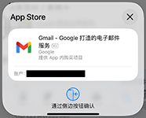

# IPAbuyer

## 软件介绍

- 刚刚拿到iPhone，受折磨于反复按下锁屏键购入App；
- 还是担心小众优质App被下架？
- 使用IPAbuyer，将App统统收入囊中！

## AppStore购买流程

1. 打开App Store
2. 登录Apple ID
3. 找到Gmail
4. 点击获取
5. 等待弹窗
6. 双击锁屏按钮
7. 找到Chrome
8. 点击获取
9. 等待弹窗
10. 双击锁屏按钮
11. 找到Gemini
12. 点击获取
13. 等待弹窗
14. 双击锁屏按钮

## IPAbuyer购买流程

1. 打开IPAbuyer
2. 登录Apple ID
3. 搜索Google
4. 批量选择Gmail、Chrome和Gemini
5. 点击购买
6. 完成

## 如何下载？
